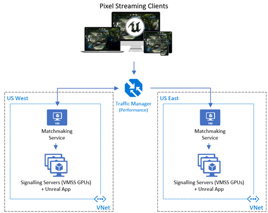

# Pixel Streaming in Azure

### Important

**Important:** Before cloning this repo you must install the LFS extension at: https://git-lfs.github.com/ and open a git/console command window and type git lfs install to initialize git-lfs. Then in your cloned folder, you need to run "git lfs install". There are large binaries in the repo, thus we needed to enable Git Large File Storage capabilities. Also, due to licensing we are unable to include `\Engine\Binaries\ThirdParty` dlls exported from Unreal for your app in this repo, so you'll need to copy your own `Binaries\` folder into the repo and check them in before the `PixelStreamingDemo.exe` app will run locally and remotely. See the [Unreal 3D App](#unreal-3d-app) section for details of this and other important steps.

**Important:** The main branch of this repo supports 3D Applications targeting Unreal Engine 4.27. If your application uses the previous 4.26 version of Unreal Engine please change the branch to `ue-4.26` or use the `v4.26` release tag.  

# Contents

- [Pixel Streaming in Azure](#pixel-streaming-in-azure)
    - [Important](#important)
- [Contents](#contents)
- [Overview](#overview)
  - [Additions Added by Microsoft](#additions-added-by-microsoft)
- [Architecture](#architecture)
  - [User Flow](#user-flow)
- [Azure SKU Recommendations](#azure-sku-recommendations)
- [Optimizing Pixel Streaming in Azure](#optimizing-pixel-streaming-in-azure)
  - [Recommendations for Further Optimizations](#recommendations-for-further-optimizations)
- [Configurations](#configurations)
  - [Terraform Configuration](#terraform-configuration)
  - [Deployment Script Configurations](#deployment-script-configurations)
  - [Matchmaker Configuration](#matchmaker-configuration)
  - [Signaling Server Configuration](#signaling-server-configuration)
    - [TURN / STUN Servers](#turn--stun-servers)
  - [Unreal 3D App](#unreal-3d-app)
  - [Autoscaling Configuration](#autoscaling-configuration)
  - [Player HTML &amp; Custom Event Configuration](#player-html--custom-event-configuration)
- [Deployment](#deployment)
- [Redeploying Updates](#redeploying-updates)
- [Shutting Down and Restarting Later](#shutting-down-and-restarting-later)
  - [Shutting down the core compute](#shutting-down-the-core-compute)
  - [Starting back up the core compute](#starting-back-up-the-core-compute)
- [Monitoring](#monitoring)
- [Supporting the Solution](#supporting-the-solution)
- [Terraform](#terraform)
  - [Folder Structure](#folder-structure)
  - [Contributing](#contributing)
  - [Trademarks](#trademarks)


# Overview

This document goes through an overview on how to deploy Unreal Engine&#39;s Pixel Streaming technology in Azure at scale, which is a technology that Epic Games provides in their Unreal Engine to stream remotely deployed interactive 3D applications through a browser (i.e., computer/mobile) without the need for the connecting client to have GPU hardware. Additionally, this document will describe the customizations Azure Engineering has built on top of the existing Pixel Streaming solution to provide additional resiliency, logging/metrics and autoscaling specifically for production workloads in Azure. The additions built for Azure are released here on GitH, which consists of an end-to-end solution deployed via Terraform to spin up a multi-region deployment with only a few Terraform commands. The deployment has many configurations to tailor to your requirements such as which Azure region(s) to deploy to, the SKUs for each VM/GPUs, the size of the deployment, HTTP/HTTPs and autoscaling policies (node count &amp; percentage based).

For a detailed overview of Unreal Pixel Streaming and architectures in Azure, see our documentation [here](https://docs.microsoft.com/en-us/gaming/azure/reference-architectures/unreal-pixel-streaming-in-azure). For a more simplified quick-start for the process on manually deploying to a single VM with Matchmaker and Signaling Server in Azure, see the Microsoft documentation [here](https://docs.microsoft.com/en-us/gaming/azure/reference-architectures/unreal-pixel-streaming-deploying). To jump directly to the documented steps for deploying this solution in Azure, click [here](#deployment).

## Additions Added by Microsoft

Microsoft has worked with Epic to customize Pixel Streaming for the cloud using Microsoft Azure, which has resulted in many key additions to deploy and monitor a Pixel Streaming solution at scale (some can be found here: [GitHub PR request #7698](https://github.com/EpicGames/UnrealEngine/pull/7698)). Below are the notable additions that have been incorporated into a Fork of Unreal Engine on GitHub:

- **General**
  - Azure integration scripts, as the current product only exports out AWS scripts.
  - End-To-End deployment in Microsoft Azure with Terraform
  - Autoscaling capabilities to enable thresholds for scaling up or scaling back down GPU compute.
  - Multi-region deployments in Azure with utility scripts for spin up/down/deployment management.
  - Multiple streams per GPU (depending on complexity and resource usage of the 3D app).
  - Automated installation of pre-requisites for the VMs (i.e., VC++, DirectX, Node.js, NVIDIA drivers, etc.)
  - Auto startup tasks if the services/3D app close unexpectedly or when starting/restarting the VMs.
- **Matchmaker**
  - Resiliency for recovering from disconnects with the Signaling Server.
  - Removed duplication of redirects causing shared sessions.
  - HTTPS capabilities for the Matchmaker Node.js service
  - Host and custom application metrics for monitoring in Azure with Application Insights
  - Configuration file to avoid hard coding ports and config items in the JavaScript code.
  - Autoscaling policies based on total and available connections, which trigger scale operations on the Virtual Machine Scale Set that hosts the Signaling Server and 3D application.
  - Added a /ping API to use for Traffic Manager health checks.
- **Signaling Service**
  - Resiliency for failed Matchmaker connections
  - Retries when WebSocket failures occur.
  - Stderror logging to log any unhandled thrown errors.
  - js scripting to restart and bring back up the 3D app when a user session ended (via scripts\OnClientDisconnected.ps1), giving new users a fresh session.

# Architecture



## User Flow

Let&#39;s walk through the general flow of what is showed in the architecture diagram above when a user connects to the service:

1. Clients connect to their closest region (1 .. N regions) via Traffic Manager, which does a DNS redirect to the [Matchmaking service](https://docs.unrealengine.com/en-US/Platforms/PixelStreaming/Hosting/index.html) VM.
2. The Matchmaking Service redirects to an available node on the paired VMSS which holds the Signaling Service and Unreal 3D app (doesn&#39;t use the Load Balancer). The VMSS nodes have [public Ips for each](https://docs.microsoft.com/en-us/azure/virtual-machine-scale-sets/virtual-machine-scale-sets-networking#public-ipv4-per-virtual-machine) VM and not a single private LB IP, otherwise the Matchmaking Service won&#39;t be able to redirect to the appropriate VMSS that&#39;s available (i.e., a LB would pick a _random_ one)
3. The Signaling Service streams back the 3D app rendered frames and audio content to the client via WebRTC, brokering any user input back to the 3D app for interactivity.

##

# Azure SKU Recommendations

Below are the recommended compute SKUs for general usage of Pixel Streaming in Azure:

- **Matchmaker** : Standard\_F4s\_v2 or similar should be sufficient. 4 cores with a smaller memory footprint should be fine for most deployments as there is very little CPU/Memory usage due to the instant redirecting users to Signaling Servers.
- **Signaling Server** : Standard\_NV12s\_v3 or Standard\_NV6 might be the best price per performance GPU VMs in Azure for Pixel Streaming, with the newer [NV12s\_v3](https://docs.microsoft.com/en-us/azure/virtual-machines/nvv3-series)&#39;s providing better CPU performance at a similar price-point to the older [NV6s](https://docs.microsoft.com/en-us/azure/virtual-machines/nv-series). Both have a NVIDIA Tesla M60 GPU. If Ray Tracing is required in your app you&#39;ll need to look at the [NCas T4 v3](https://docs.microsoft.com/en-us/azure/virtual-machines/nct4-v3-series) series VMs in limited regions (preview). As GPU SKUs are in high demand, it&#39;s important to work with the capacity team early on to request the needed quota for any event or deployment that will be spinning up a great number of GPU VMs.

**Important:** It is recommended to first deploy your Pixel Streaming executable and run it on your desired GPU SKU to see the performance characteristics around CPU/Memory/GPU usage to ensure no resources are being pegged and frame rates are acceptable. Consider changing resolution and frames per second of the UE4 app to achieve acceptable quality per your requirements. Additionally, consider the IOPS / latency requirements for the 3D app when choosing a disk, as [SSDs](https://azure.microsoft.com/en-us/pricing/details/managed-disks/) and/or striping disks will be key to gaining the best disk speed (some GPU SKUs might not support Premium SSDs so also consider disk striping for adding IOPS).

# Optimizing Pixel Streaming in Azure

Be sure to check out the Pixel Streaming in Azure Overview [documentation](https://docs.microsoft.com/en-us/gaming/azure/reference-architectures/unreal-pixel-streaming-in-azure#optimizing-pixel-streaming-in-azure) to learn more about optimizing for Azure VM SKUs, performance and pricing optimizations.

## Recommendations for Further Optimizations

The current customized solution in GitHub has many additions that make deploying Pixel Streaming in Azure at scale easier, and below are even more improvements on those customizations which would make it even better:

- **Add Queuing to Matchmaker** : Currently when a Matchmaker can&#39;t send a user to any available Signaling Server there is no queuing as users stack up waiting for an available stream and would be good to put in a queuing system in Matchmaker to allow the user waiting the longest to get the next available server.
- **Matchmaker Database:** To have improved resiliency of the MM it could share a common database between one or two MM VMs to keep connection/availability status in case one is restarted/goes down. Currently this connection status and stream availability is not persisted. This could be persisted to a Database like CosmosDB/SQL, or even to the local disk via a simple JSON file.
- **Multiple Resolutions for Desktop/Mobile:** For mobile users there might not need to be a higher resolution for those streams, and so having multiple streams with different resolutions could maximize performance/costs to send mobile users to mobile streams (e.g., 720p) and desktop users go to higher resolution streams (i.e., 1080p). Either this could be lower resolution streams packed on certain GPU VMs, or a mix (e.g., 3 streams with 1080p, 720p, 720p).
- **Deploying with Azure DevOps or GitHub Actions:** Currently much of the orchestration of deploying the code is done through PowerShell scripts in the scripts\ folder, but much of this could be moved into deployment workflows such as Azure DevOps or GitHub Actions. These were left out to reduce extra dependencies and complexity for those not familiar with these technologies, but for a production solution it would be recommended to utilize them (e.g., ADO, GitHub Actions, Jenkins, etc.).

# Configurations

Below are notable configurations to consider when deploying the Pixel Streaming solution in Azure.

## Terraform Configuration

There was a tremendous amount of work that went into building out the Terraform deployment for Pixel Streaming; however, unless you plan on making major modifications you can focus just on the following 3 files:

[iac\terraform.tfvars](https://github.com/Azure/Unreal-Pixel-Streaming/blob/release/iac/terraform.tfvars): This stores the global variable for the _deployment\_regions_, which specify which Azure region(s) will be used (default is &quot;eastus&quot;) and their Virtual Network ranges:

[iac\region\variables.tf](https://github.com/Azure/Unreal-Pixel-Streaming/blob/release/iac/region/variables.tf): This is the most important file to be familiar with, as it has the configs for the _gitpath_ (change to your Git fork), _pixel\_stream\_application\_name (change to your UE4 app name)_, along with other notable parameters such as desired FPS (default 60), resolution (default 1080p), starting instance count (default 1), instances per node (default 1), and Azure VM SKUs for the MM (default Standard\_NV6) and SS (Standard\_F4s\_v2).

[iac\variables.tf](https://github.com/Azure/Unreal-Pixel-Streaming/blob/release/iac/variables.tf): This global variables file can mostly be ignored, unless needing to change the global resource group&#39;s name (_base\_resource\_group\_name_), location (_global\_region_, default: eastus), Traffic Manager port or storage account settings (tier/type).

See the [Terraform](#terraform) section to learn more about the deployment files.

## Deployment Script Configurations

The Git location referenced in the deployment is stored in the [iac\region\variables.tf](https://github.com/Azure/Unreal-Pixel-Streaming/blob/release/iac/region/variables.tf) file. **Important:** You must have read access with a [Personal Access Token](https://docs.github.com/en/github/authenticating-to-github/creating-a-personal-access-token) (PAT) to the specified repository for the deployment to work, since when the VMs are created there is a git clone used to deploy the code to the VMs. Also, you&#39;ll want to validate if your organization needs to have [Enterprise SSO enabled](https://docs.github.com/en/free-pro-team@latest/github/authenticating-to-github/authorizing-a-personal-access-token-for-use-with-saml-single-sign-on) for your PAT.

## Matchmaker Configuration

Below are the configurations available to the Matchmaker, which a config.json file was added to the existing Matchmaker code to reduce hard coding in the Matchmaker.js file:

```yaml
{
  // The port clients connect to the Matchmaking service over HTTP
  "httpPort": 80,
  // The Matchmaking port the Signaling Service connects to the matchmaker over sockets
  "matchmakerPort": 9999,
  // Instances deployed per node, to be used in the autoscale policy (i.e., 1 unreal app running per GPU VM) – not yet supported
  "instancesPerNode": 1,
  // Amount of available Signaling Service / App instances to be available before we must scale up (0 will ignore)
  "instanceCountBuffer": 5,
  // Percentage amount of available Signaling Service / App instances to be available before we must scale up (0 will ignore)
  "percentBuffer": 25,
  //The amount of minutes of no scaling up activity before we decide we might want to see if we should scale down (i.e., after hours--reduce costs)
  "idleMinutes": 60,
  // % of active connections to total instances that we want to trigger a scale down if idleMinutes passes with no scaleup
  "connectionIdleRatio": 25,
  // Min number of available app instances we want to scale down to during an idle period (idleMinutes passed with no scaleup)
  "minIdleInstanceCount": 0,
  // The total amount of VMSS nodes that we will approve scaling up to
  "maxInstanceScaleCount": 500,
  // The Azure subscription used for autoscaling policy (set by Terraform)
  "subscriptionId": "",
  // The Azure Resource Group where the Azure VMSS is located, used for autoscaling (set by Terraform)
  "resourceGroup": "",
  // The Azure VMSS name used for scaling the Signaling Service / Unreal App compute (set by Terraform)
  "virtualMachineScaleSet": "",
  // Azure App Insights ID for logging and metrics (set by Terraform)
  "appInsightsId": ""
}
```

## Signaling Server Configuration

Below are configs available to the Signaling Server in their config, some added by Microsoft for Azure:

```yaml
{
  "UseFrontend": false,
  "UseMatchmaker": true, // Set to true if using Matchmaker.
  "UseHTTPS": false,
  "UseAuthentication": false,
  "LogToFile": true,
  "HomepageFile": "player.htm",
  "AdditionalRoutes": {},
  "EnableWebserver": true,
  "matchmakerAddress": "",
  "matchmakerPort": "9999", // The web socket port used to talk to the MM.
  "publicIp": "localhost", // The Public IP of the VM -- set by Terraform.
  "subscriptionId": "", // The Azure subscription -- set by Terraform.
  "resourceGroup": "", // Azure RG -- set by Terraform.
  "virtualMachineScaleSet": "", // Azure VMSS -- set by Terraform.
  "appInsightsId": "" // Azure App Insights ID for logging/metrics -- set by Terraform.
}
```

### TURN / STUN Servers

In some cases, you might need a STUN / TURN server in between the UE4 app and the browser to help identify public IPs (STUN) or get around certain NAT&#39;ing/Mobile carrier settings (TURN) that might not support WebRTC. Please refer to Unreal Engine&#39;s [documentation](https://docs.unrealengine.com/en-US/SharingAndReleasing/PixelStreaming/Hosting/index.html) for details about these options; however, for most users a STUN server should be sufficient. Inside of the `SignallingWebServer\` folder there are PowerShell scripts used to spin up the Cirrus.js service which communicates between the user and the UE4 app over WebRTC, and `Start_Azure_SignallingServer.ps1` or `Start_Azure_WithTURN_SignallingServer.ps1` are used to launch with STUN / TURN options. Currently the `Start_Azure_SignallingServer.ps1` file points to a public Google STUN server (`stun.l.google.com:19302`), but it&#39;s highly recommended to **deploy your own for production**. You can find many other public options online as well (e.g., [1](https://gist.github.com/mondain/b0ec1cf5f60ae726202e), [2](https://stackoverflow.com/questions/20068944/how-to-self-host-to-not-rely-on-webrtc-stun-server-stun-l-google-com19302/20134888#20134888)). Unreal Engine exports out `stunserver.exe` and `turnserver.exe` when packaging up the Pixel Streaming 3D app to setup on your own servers (not included in repo):
 `\Engine\Source\ThirdParty\WebRTC\rev.23789\programs\Win64\VS2017\release\`

`Start_Azure_SignallingServer.ps1` is called by `runAzure.bat` when deploying the Terraform solution, so if a TURN server is needed this can be changed in runAzure.bat to call `Start_Azure_WithTURN_SignallingServer.ps1` with the right TURN server credentials updated in the PS file.

## Unreal 3D App

The Unreal 3D app and dependencies reside in GitHub (Git-LFS enabled) under the Unreal\ folder. The Unreal\ folder structure aligns with what is exported out of Unreal Engine, and below are the specific files\folders you will want to copy over the existing files provided in the example GitHub repository:

1. Your exported `<ProjectName>.exe` should replace `Unreal\PixelStreamingDemo.exe`
2. `<ProjectName>\` folder associated with the `<ProjectName>.exe` should replace the `Unreal\PixelStreaming\` folder.
3. **Important:** Replace the Binaries folder of the repo with **your** Binaries folder that was generated when building your UE4 app (i.e., `\Engine\Binaries\`), as the third-party dlls and versions contained in the `\Engine\Binaries\ThirdParty` folder are specific to what was used in your 3D application. Due to licensing we are not able to include the .dlls in this repo, so it's important that you add them yourself. Make sure you then can click on your `<ProjectName>.exe' to run it locally sucessfully in your cloned repo folder to ensure all dependencies are copied over. This is the only thing needed to be copied over from your own Engine\ folder to the repo.
4. **Nothing more is needed to copy** over unless you&#39;ve changed any player.htm or specific customizations to the MM or SS web servers. These changes must be merged with the Microsoft special customizations and **not replaced over our WebServer\ files** to ensure a correct merge.
5. **Important:** Be sure to check in any code/app changes back into your forked repo as the Terraform deployment pulls from GitHub on your deployment and not your local resources.

The Unreal application has some key parameters that are passed in upon startup, which the Terraform deployment and PowerShell script (`startVMSS.ps1`) handles for you:
```dos
<PixelStreamingApp>.exe -AudioMixer -PixelStreamingIP=localhost -PixelStreamingPort=8888 -WinX=0 -WinY=0 -ResX=1920 -ResY=1080 -Windowed -RenderOffScreen -ForceRes
```
Notable app arguments to elaborate on for your understanding (see Unreal [docs](https://docs.unrealengine.com/en-US/SharingAndReleasing/PixelStreaming/PixelStreamingReference/#unrealenginecommand-lineparameters) for others):

- `-ForceRes`: It is important to make sure this argument is used to force the Azure VM&#39;s display adapter to use the specified resolution (i.e., `ResX`/`ResY`).
- `-RenderOffScreen`: This renders the app in the background of the VM, so it won&#39;t be seen if RDP&#39;ing into the box, which ensures that a window won&#39;t be minimized and not stream back to the user.
- `-Windowed`: If this flag isn&#39;t used the resolution parameters will be ignored (i.e., `ResX`/`ResY`).
- `-PixelStreamingPort`: This needs to be the same port specified in the Signaling Server, which is the port on the VM that the communicates with the 3D Unreal app over web sockets.

## Autoscaling Configuration

Microsoft has added the ability to autoscale the 3D stream instances up and down, which is done from new logic added to the Matchmaker which evaluates a desired scaling policy and then scales the Virtual Machine Scale Set compute accordingly. This requires that the Matchmaker has a System Assigned [Managed Service Identity](https://docs.microsoft.com/en-us/azure/active-directory/managed-identities-azure-resources/overview) (MSI) for the VM with permissions to scale up the assigned VMSS resource, which is setup for you already in the Terraform deployment. This eliminates the need to pass in special credentials to the Matchmaker such as a Service Principal, and the MSI is given Contributor access to the region&#39;s Resource Group that was created in the deployment—please adjust as needed per your security requirements.

Here are the key parameters in the Matchmaker config.json required to configure on autoscaling for the Signaling Server and 3D app (VMSS nodes). **Important:** Be sure to check in any config changes back into your forked repo as the Terraform deployment pulls from GitHub on your deployment and not your local resources.

**instanceCountBuffer** : Min amount of available streams before triggering a scale up (0 will ignore this). For instance, if you have 5 it will only trigger a scale up if only 4 or less streams are available.

**percentBuffer** : % of available streams before triggering a scale up (0 will ignore this). For instance, if you have 25 it will trigger a scale up if less than 25% of total connected Signaling Servers are available to stream.

**idleMinutes** : How many minutes of no new scale operations before considering a scale down (e.g., scale down after hours)

**connectionIdleRatio** : % of active streams to total instances that we want to trigger a scale down after idleMinutes passes.

**minIdleInstanceCount** : The number of VMSS nodes we want during an idle period (e.g., never go below 10 nodes)

**maxInstanceScaleCount** : The max number of VMSS nodes to scale out to (e.g., never scale above 250 VMs)

## Player HTML &amp; Custom Event Configuration

When Unreal Pixel Streaming is packaged from Unreal Engine the solution contains a `\Engine\Source\Programs\PixelStreaming\WebServers\SignallingWebServer\player.htm` file to customize the experience, along with the ability to customize JavaScript functions to send custom events between the browser and the 3D Unreal application. Please see Epic&#39;s robust [documentation](https://docs.unrealengine.com/en-US/SharingAndReleasing/PixelStreaming/CustomPlayer/index.html) on how to make these extra customizations.

# Deployment

This section will walk through all the steps necessary to deploy this solution in Azure. **Currently the deployment expects a Windows OS** as it references powershell.exe directly, though a simple symlink of pwsh to powershell.exe on Linux apparently works (will be added in a future release). **Important:** Be sure to first follow the guidance in the [Configurations](#_Configurations) section to setup the git repo location.

To deploy the solution, use the steps here:

- **Install the following prerequisites:**
  - Install [Git](https://git-scm.com/download/win) and [Git LFS](https://github.com/git-lfs/git-lfs) as well (i.e., &quot;git lfs install&quot; via PowerShell after installing Git)
  - Make sure you have [Azure CLI installed](https://docs.microsoft.com/en-us/cli/azure/install-azure-cli).
  - Make sure you have [terraform installed](https://learn.hashicorp.com/tutorials/terraform/install-cli).
- Do a [git clone](https://git-scm.com/docs/git-clone) on the repo with a depth of 1 or a [git pull](https://git-scm.com/docs/git-pull) if already cloned. **Note:** If you don&#39;t use a --depth 1 it will download the entire Git history for Unreal Engine ( **will take a long time** ).
```powershell
  git clone --depth 1 https://github.com/Azure/Unreal-Pixel-Streaming.git
```
- Run PowerShell as Administrator (needed for setting PowerShell&#39;s execution policy below) and [Login to Azure](https://docs.microsoft.com/en-us/cli/azure/authenticate-azure-cli) via Azure CLI in the PowerShell window:
```powershell
  az login
```
- [Set the Azure subscription](https://docs.microsoft.com/en-us/cli/azure/manage-azure-subscriptions-azure-cli#change-the-active-subscription) with Azure CLI to deploy into: 
```powershell
az account set --subscription "SUBSCRIPTION_NAME_HERE"
```
- Set PowerShell&#39;s [execution policy](https://docs.microsoft.com/en-us/powershell/module/microsoft.powershell.security/set-executionpolicy?view=powershell-7.1) (per your security needs): 
```powershell
Set-ExecutionPolicy -ExecutionPolicy RemoteSigned -Scope LocalMachine
```
- Delete the `terraform.tfstate` file in the `iac\` folder if existing from a previous deployment.
- In a PowerShell window navigate to the \iac folder where the repo was cloned and use these 3 commands with your [Git PAT](https://docs.github.com/en/github/authenticating-to-github/creating-a-personal-access-token) since the repo is private (replace PUT_GIT_PAT_HERE with PAT):
```powershell
terraform init
terraform validate
terraform apply -var 'git-pat=PUT_GIT_PAT_HERE' --auto-approve
```
This process can take between 15-30 minutes to deploy, depending on resources deployed (i.e., UE4 app size, regions chosen, etc.). The PowerShell window should finish with a successfully completed message. The deployment creates 2 resources groups in Azure:

1. `<random_prefix>-global-unreal-rg` : This stores all global resources such as the Traffic Manager, Key Vault and Application Insights.
2. `<random_prefix>-<region>-unreal-rg` : This stores the Virtual Machine Scale Set (VMSS) for the GPU nodes that have the 3D app and Signaling Server, the Matchmaker VM and Virtual Network resources.

**Testing the Deployment:** Open up a web browser and paste in the DNS name from the Traffic Manager in the global Resource Group (e.g., `http://<random_prefix>.trafficmanager.net`) to be redirected to an available stream. The DNS name can be found under &quot;DNS name: _&lt;link&gt;_&quot; in the **Overview** page of the Traffic Manager resource in the Azure Portal. If you&#39;ve deployed to multiple regions, you will be redirected to the closet Azure region.

Post the deployment there are processes **that Terraform will**  **run** on the following solution components in each region upon startup of each VM:

- Matchmaker VM
  - Script: `startMMS.ps1`
  - Executable: `Node.exe`
  - Scheduled Task calling the script on restart: `StartMMS`
- Backend (Web &amp; Signaling Services) VMSS
  - Script: `startVMSS.ps1`
  - Executable: `Node.exe`
  - Executable: `<PixelStreamingApp>.exe`
  - Scheduled Task calling the script on restart: `StartVMSS`

# Redeploying Updates

The easiest way to redeploy during the solution would be to do the following for each piece:

- **Signaling Servers / 3D app**
  - Scale down the VMSS to 0 in each region, wait for it to finish, then scale back up to the desired count again (pulls down fresh code from Git), restart the Matchmaker VMs in each region, then restarting the VMSS nodes in each region to give a full reset and redeployment.
- **Matchmakers**
  - Without having to redeploy everything from Terraform, the easiest way is to manually log into each of the deployed MM VM&#39;s and copy the code changes over from git – unless there needs to be any terraform transformations and, in that case, you will need to redeploy it fully from Terraform. If it&#39;s just a JavaScript change, replacing the matchmaker.js file is sufficient. Refer to the Matchmaker section above for the folder location.
- **Full redeployment**
  - Use the following steps to redeploy the solution from Terraform:
    - Delete the `terraform.tfstate` file in the `iac\` folder.
    - Do a Git sync and grab the latest updates.
    - In the PowerShell console use these 3 commands (Get a PAT from GitHub):
```powershell
terraform init
terraform validate
terraform apply -var 'git-pat=PUT_GIT_PAT_HERE' --auto-approve
```
# Shutting Down and Restarting Later

If we need to shut down the solution and start it up later, see below for the process. This is just shutting down the compute for the Matchmaker and the Signaling Servers, which are the costlier resources (especially the SS GPU VMs) vs. deleting all the resources and requiring a time-consuming redeployment.

## Shutting down the core compute

- **Matchmakers**
  - Go to each regional [Resource Group](https://docs.microsoft.com/en-us/azure/azure-resource-manager/management/manage-resource-groups-portal) in the Azure Portal (i.e., \*-eastus-unreal-rg) and click on the matchmaker VMs (e.g., \*-mm-vm0). Once entered the **Overview** page of the VM choose the **Stop** button at the top to turn off the VM and not be charged for any further compute. Do this for all regions that are deployed.

- **Signaling Servers / 3D app**
  - Go to each regional [Resource Group](https://docs.microsoft.com/en-us/azure/azure-resource-manager/management/manage-resource-groups-portal) in the Azure Portal (i.e., \*-eastus-unreal-rg) and click on the Virtual Machine Scale Set (VMSS) resources (e.g., \*vmss). Once entered the **Overview** page of the VMSS choose the **Stop** button at the top to turn off the VMSS instances and not be charged for any further compute. Do this for all regions that are deployed. See the Redeploying Updates section to see how to scale down to a specific number of VMSS nodes versus turning them all off.

## Starting back up the core compute

- **Matchmakers**
  - Go to each regional [Resource Group](https://docs.microsoft.com/en-us/azure/azure-resource-manager/management/manage-resource-groups-portal) in the Azure Portal (i.e., \*-eastus-unreal-rg) and click on the matchmaker VMs (e.g., \*-mm-vm0). Once entered the **Overview** page of the VM choose the **Start** button at the top to turn on the VM. Do this for all regions that are deployed first before turning on the VMSS nodes so they can connect to the MM cleanly. The MM will come back on and start the MM service from the ScheduledTask `StartMMS` setup on Windows.

- **Signaling Servers / 3D app**
  - Go to each regional [Resource Group](https://docs.microsoft.com/en-us/azure/azure-resource-manager/management/manage-resource-groups-portal) in the Azure Portal (i.e., \*-eastus-unreal-rg) and click on the Virtual Machine Scale Set (VMSS) resources (e.g., \*vmss). Once entered the **Overview** page of the VMSS choose the **Start** button at the top to turn back on the VMSS instances. Do this for all regions that are deployed. Each instance will come back on and start the SS and 3D automatically from the ScheduledTask `StartVMSS` setup on Windows.

# Monitoring

Currently automated Azure dashboards aren&#39;t built when deploying the solution; however, outside of regular host metrics like CPU/Memory, some key metrics will be important to monitor in Azure Monitor/Application Insights such as:

- `SSPlayerConnected` – The most key metric to know when a user connected (use Count)
- `SSPlayerDisconnected` – When a user disconnects from the Signaling Server (use Count)
- `AvailableConnections` – The amount of available Signaling Servers not being used (use Avg)
- `TotalConnectedClients` – Amount of Signaling Servers connected to the Matchmaker (use Avg)
- `TotalInstances` – The total number of VMSS instances
- `PercentUtilized` – The percentage of Signaling Servers (streams) in use (use Avg)
- `MatchmakerErrors` – The number of Matchmaker (use Count)

View a tutorial on creating a dashboard in Azure Monitor [here](https://docs.microsoft.com/en-us/azure/azure-monitor/essentials/tutorial-metrics-explorer).

# Supporting the Solution

In supporting the deployed solution, it is recommended to do a few key things:

- Monitor the dashboards created using the recommended metrics and make sure that there are not unusually high or low connections exists, to validate if usage is spiking/pegging or unusual traffic is happening like too low (something is wrong?) or too high (a potential bot?).
- Looks for an unusual number of errors being logged, and potentially ignore any syntax error exceptions that say &quot;Unexpected token &lt;token&gt; in Json&quot; as that appears to be hackers trying to send garbage to the Matchmaker.
- If anything gets broken or out of whack you can follow the guidance in the Updates section above which is to restart the Matchmakers, then restart the VMSS nodes for each region. That should force everything to come back online fresh again. If anything is corrupted, scaling down the VMSS to 0, scaling back up to the desired count, restarting the MM&#39;s then restarting the VMSS nodes will do a full reset and redeploy.

# Terraform

Below are the key files in the Terraform setup to understand when altering the code and tweaking the parameters.

## Folder Structure

- `\iac` is the root of all infrastructure for the solution.
  - [Outermain.tf](https://github.com/Azure/Unreal-Pixel-Streaming/blob/release/iac/outermain.tf) is the primary TF File. This file sets base variables like the 5 character prefix on all assets, takes the optional GitHub PAT for private repos and deploys the Global Resource Group, and &quot;Stamps&quot; which are each of the regional deployments
- `\iac\region` is the folder with the files to deploy a region
  - [Main.tf](https://github.com/Azure/Unreal-Pixel-Streaming/blob/release/iac/region/main.tf) is the TF file that handles deployment of all assets in each regional deployment
  - [Variables.tf](https://github.com/Azure/Unreal-Pixel-Streaming/blob/release/iac/region/variables.tf) is the TF file that has parameters for each of the regional deployments

## Contributing

This project welcomes contributions and suggestions.  Most contributions require you to agree to a
Contributor License Agreement (CLA) declaring that you have the right to, and actually do, grant us
the rights to use your contribution. For details, visit https://cla.opensource.microsoft.com.

When you submit a pull request, a CLA bot will automatically determine whether you need to provide
a CLA and decorate the PR appropriately (e.g., status check, comment). Simply follow the instructions
provided by the bot. You will only need to do this once across all repos using our CLA.

This project has adopted the [Microsoft Open Source Code of Conduct](https://opensource.microsoft.com/codeofconduct/).
For more information see the [Code of Conduct FAQ](https://opensource.microsoft.com/codeofconduct/faq/) or
contact [opencode@microsoft.com](mailto:opencode@microsoft.com) with any additional questions or comments.

## Trademarks

This project may contain trademarks or logos for projects, products, or services. Authorized use of Microsoft 
trademarks or logos is subject to and must follow 
[Microsoft's Trademark & Brand Guidelines](https://www.microsoft.com/en-us/legal/intellectualproperty/trademarks/usage/general).
Use of Microsoft trademarks or logos in modified versions of this project must not cause confusion or imply Microsoft sponsorship.
Any use of third-party trademarks or logos are subject to those third-party's policies.

© 2021, Microsoft Corporation. All rights reserved
